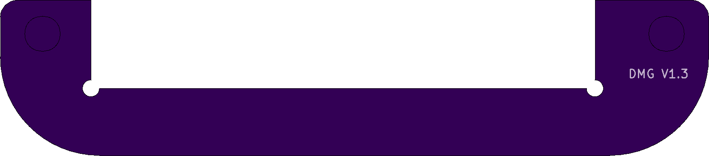
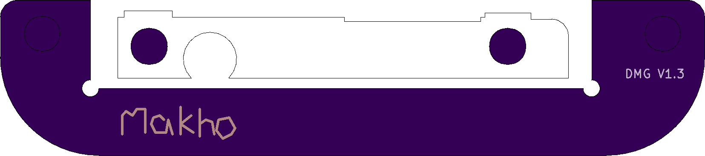

# Q5 LCD Brackets
Brackets for ease of installing Funnyplaying "Retro Pixel" IPS kits or similar in a DMG Game Boy or a MGB Game Boy Pocket (or Game Boy Light)

Tested working but still unfinished, will be updating files soon with better looking PCBs. Outline should be final but I want to add some art or something to the design. Current iteration of the MGB kit will show text when installed in a clear shell and I intend on fixing this. 

There are three different versions, DMG, MGB, and a combined version. The combined version should be used if ordering the DMG bracket from oshpark as you'll get MGB brackets and DMG brackets for just the cost of the DMG brackets. The combined version should not be used for other manufacturers (e.g. jlcpcb) as you'll get charged a panelization fee. These are LARGE brackets compared to previous versions and are a bit pricy so going with another vendor for the DMG bracket may be more cost effective. 

Oshpark will take the .kicad_pcb files, other manufacturers will need the gerber files and I neglected to upload them pre-zipped. I will fix that when I get the files to my liking. 

Videos will be uploaded soon on install. If ordering from oshpark, you'll need to file down the tabs from manufacture otherwise the brackets won't fit. 

